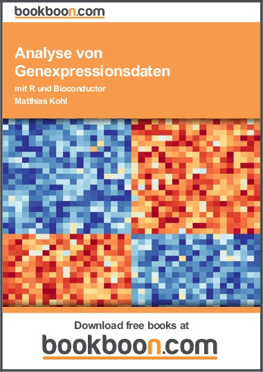

# Analyse von Omics-Daten mit R und Bioconductor

In diesem Repository finden Sie Dateien als Ergänzung und Erweiterung meines Buches "Analyse von Genexpressionsdaten mit R und Bioconductor".

Kurze ergänzende Videos finden Sie unter: <https://www.youtube.com/playlist?list=PLRgOZXM8LZ0i19SyzhSwkLaYlL8Esuk5j>
